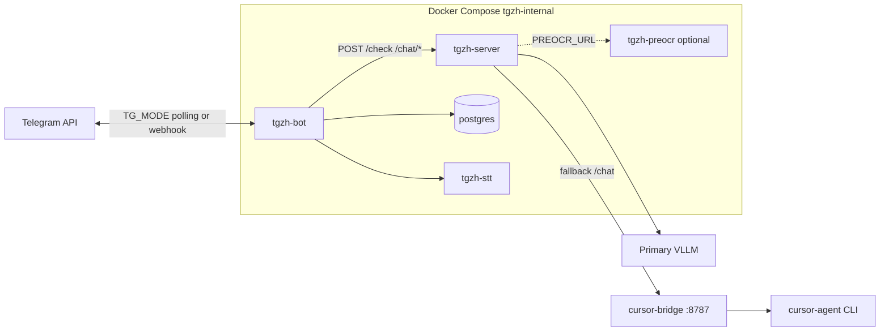

# Интеграция с tgzh

База знаний для подключения внешних проектов к стеку проверки ДЗ и Cursor-чату.

Известные сбои - [error-registry.md](error-registry.md).

## Компоненты



| Компонент | Роль | Обязателен |
|-----------|------|------------|
| **tgzh-bot** | Telegram UI, FSM, вызовы `SERVER_URL` | да |
| **tgzh-server** | FastAPI: проверка ДЗ, `/chat/stream` | да |
| **postgres** / SQLite | Профили, сессии, статистика | postgres опционально |
| **Primary VLLM** | Vision-модель для `/check` | при `AI_MOCK=0` |
| **cursor-bridge** | OpenAI-совместимый proxy к `cursor-agent` | для `/chat`, recheck Cursor |
| **tgzh-preocr** | OCR перед VLLM/recheck по фото | опционально |
| **tgzh-stt** | Whisper для голосовых | опционально |

## HTTP API tgzh-server

Базовый URL: **`SERVER_URL`** (в Docker: `http://tgzh-server:8000`).

| Метод | Путь | Назначение |
|-------|------|------------|
| `GET` | `/health` | Healthcheck, `{"status":"ok"}` |
| `POST` | `/check` | Проверка ДЗ (фото/текст, multipart или JSON) |
| `POST` | `/check/summarize` | Сводка по нескольким частям |
| `POST` | `/check/quip` | Короткая реплика после проверки |
| `POST` | `/chat/stream` | Стрим ответа Cursor (plain text, не SSE) |

Транспорт бота к `SERVER_URL` - **httpx** с приоритетом IPv4 (`tgzh_httpx`).

### Пример: проверка доступности

```bash
curl -fsS http://127.0.0.1:8000/health
```

### Пример: chat через сервер (как бот)

```bash
curl -N -X POST http://127.0.0.1:8000/chat/stream \
  -H 'Content-Type: application/json' \
  -d '{
    "user_id": 1,
    "messages": [{"role": "user", "content": "Привет"}],
    "model": "composer-2.5"
  }'
```

Ответ - поток plain text. Ошибки fallback - в логах `tgzh-server`, клиент может получить пустой поток.

## Контракт с cursor-bridge

Исходники и установка bridge: [discourse-cursor-bridge](https://github.com/vramdibs/discourse-cursor-bridge) (Discourse webhook + OpenAI `/v1/chat/completions`). Ниже - только контракт для tgzh.

Внешний сервис: **OpenAI-compatible** `POST /v1/chat/completions` на хосте bridge (типично порт **8787**).

### На стороне tgzh (`.env`)

```env
VLLM_FALLBACK_ENABLE=1
VLLM_FALLBACK_BASE_URL=http://host.docker.internal:8787/v1
VLLM_FALLBACK_API_KEY=<совпадает с BRIDGE_OPENAI_API_KEY bridge>
VLLM_FALLBACK_MODEL=composer-2.5
```

В Docker `host.docker.internal` - доступ к bridge на хосте. На хосте без compose: `http://127.0.0.1:8787/v1`.

Опционально DNS-обход для fallback-хоста: `VLLM_FALLBACK_RESOLVE_HTTP_ECHO_URL`, `VLLM_FALLBACK_DNS_SERVERS` (см. `.env.example`).

### На стороне bridge (`.env`)

| Переменная | Назначение |
|------------|------------|
| `BRIDGE_OPENAI_API_KEY` | Bearer для клиентов (tgzh шлет как `VLLM_FALLBACK_API_KEY`) |
| `CURSOR_API_KEY` | **Обязательно** для headless `cursor-agent` |
| `CURSOR_AGENT_BIN` | Путь к бинарнику (`cursor-agent` / `agent`) |
| `CURSOR_OPENAI_WORKSPACE` | Sandbox для OpenAI-эндпоинта (default `/tmp/cursor-openai-sandbox`) |
| `BRIDGE_PORT` | Порт HTTP (default 8787) |

После смены `CURSOR_API_KEY`: `systemctl --user restart discourse-cursor-bridge`.

### Ограничения bridge

- **`stream=true` не поддержан** - bridge отвечает **400**. tgzh в `ai_checker.py` автоматически делает fallback на `stream=false`
- Модель в теле запроса маппится в `cursor-agent --model <slug>`
- Таймаут одного запуска: `BRIDGE_OPENAI_TIMEOUT_SEC` / `AGENT_TIMEOUT_SEC`

### Smoke bridge с хоста

```bash
curl -sS -X POST http://127.0.0.1:8787/v1/chat/completions \
  -H "Authorization: Bearer $BRIDGE_OPENAI_API_KEY" \
  -H 'Content-Type: application/json' \
  -d '{"model":"composer-2.5","messages":[{"role":"user","content":"Say hi"}],"stream":false}'
```

## Сеть: inbound и outbound

Два **независимых** пути (не путать с «устаревшим DNS»):

| Путь | Назначение | Типичная настройка |
|------|------------|-------------------|
| **Inbound webhook** | Telegram -> бот | KeenDNS на IP роутера, `:443` -> proxy -> `tgzh-bot:8081`, `TG_MODE=webhook` |
| **Outbound polling** | Бот -> Telegram API | `TG_MODE=polling`, egress через VPS/прокси при блокировке провайдера |

Egress-IP VPS **не** подставляется в KeenDNS для webhook.

Рекомендация при блокировке Telegram: **`TG_MODE=polling`** (штатный режим, не временный костыль).

См. инциденты [INC-2026-09-27-01](error-registry.md#inc-2026-09-27-01-бот-молчит-на-start-webhook-timeout) и [INC-2026-09-27-03](error-registry.md#inc-2026-09-27-03-ложная-диагностика-устаревший-dns).

## Чек-лист интеграции нового клиента

1. **Сервер**: `curl -fsS $SERVER_URL/health`
2. **Primary VLLM** (если нужна проверка ДЗ): `AI_MOCK=0`, доступен `VLLM_BASE_URL`
3. **Bridge** (если нужны `/chat` или recheck Cursor):
   - TCP до `VLLM_FALLBACK_BASE_URL`
   - `BRIDGE_OPENAI_API_KEY` = `VLLM_FALLBACK_API_KEY` в tgzh
   - **`CURSOR_API_KEY` в `.env` bridge** (см. [INC-2026-09-27-02](error-registry.md#inc-2026-09-27-02-chat-и-recheck-cursor---502-пустой-ответ))
   - smoke `POST /v1/chat/completions` с `stream=false`
4. **Telegram**:
   - `BOT_TOKEN` валиден
   - `TG_MODE=polling` или рабочий inbound webhook
5. **Docker**: `tgzh-bot` резолвит `tgzh-server`; для bridge с хоста - `extra_hosts: host.docker.internal:host-gateway`

## Переменные по сценариям

| Сценарий | Ключевые env |
|----------|----------------|
| Только проверка ДЗ (VLLM) | `BOT_TOKEN`, `SERVER_URL`, `VLLM_*`, `AI_MOCK` |
| + Recheck Cursor | + `VLLM_FALLBACK_*`, bridge с `CURSOR_API_KEY` |
| + `/chat` | + `CHAT_PASSWORD`, fallback как выше |
| + Pre-OCR по фото | + `PREOCR_URL`, профиль `preocr` в compose |
| + Голос в `/chat` | + `STT_BASE_URL` (`tgzh-stt`) |
| Блокировка Telegram | `TG_MODE=polling`, при необходимости `TELEGRAM_PROXY` |

## Код и тесты

| Область | Модули / тесты |
|---------|----------------|
| LLM + fallback | `ai_checker.py`, `tests/test_ai_checker.py` |
| Chat API | `server.py`, `tests/test_server.py`, `tests/test_chat_streaming.py` |
| DNS fallback HTTP | `tgzh_httpx.py`, `tests/test_tgzh_httpx.py` |
| Telegram режим | `bot.py` (`_telegram_mode`, `TG_MODE`) |

## Обновление документации

При новом инциденте - запись в [error-registry.md](error-registry.md). При изменении API или контракта bridge - [integration.md](integration.md) и корневой [README.md](../README.md).
